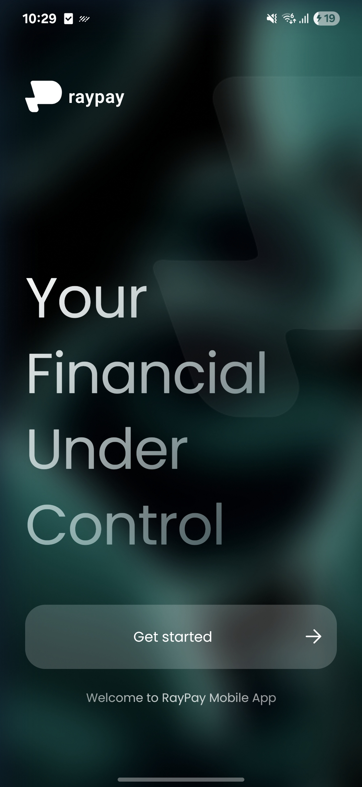
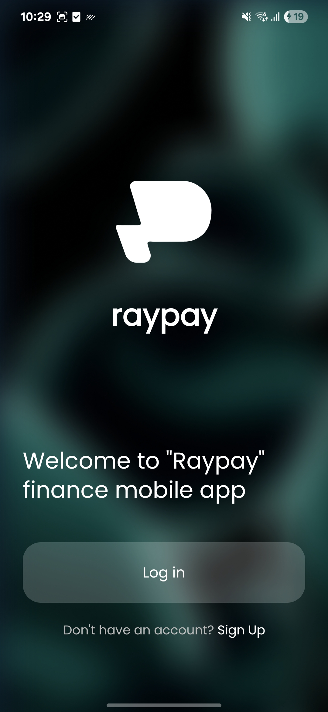
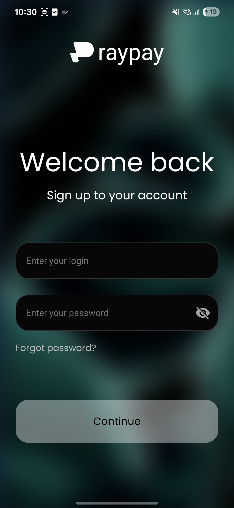
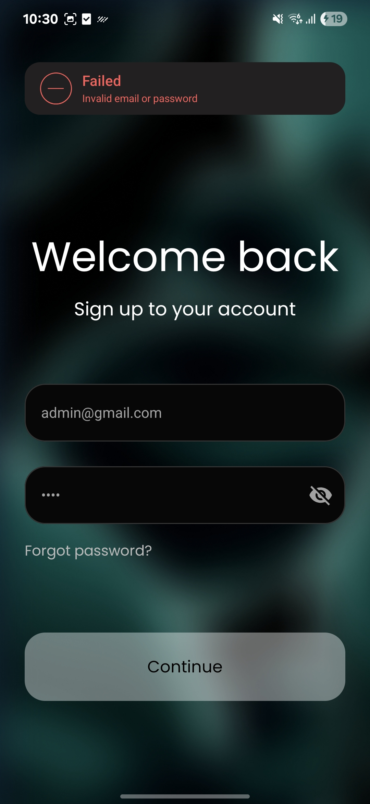

# RayPay — Finance Mobile App

A test Android application built as a portfolio project. RayPay is a finance/payment app showcasing modern Android development practices including Clean Architecture, MVI, Jetpack Compose, Firebase Authentication, and a multi-module project structure.

---

## Screenshots

| Splash | Login | Sign In | Sign In Error |
|--------|-------|---------|---------------|
|  |  |  |  |

---

## Tech Stack

| Area | Technology |
|------|-----------|
| Language | Kotlin 2.3.0 |
| UI | Jetpack Compose (BOM 2026.02.00) + Material3 |
| Architecture | Clean Architecture + MVI |
| DI | Hilt 2.58 |
| Navigation | Jetpack Navigation Compose 2.7.7 |
| Auth Backend | Firebase Authentication |
| Async | Coroutines + StateFlow + Channel |
| Build | Gradle Convention Plugins + KSP |
| Min SDK | 26 |
| Target SDK | 36 |

---

## Architecture

The project follows **Clean Architecture** with a strict separation into layers:

```
app/
├── features/
│   ├── auth          # Sign In & Login screens (MVI)
│   ├── onboarding    # Welcome/onboarding screen
│   └── home          # Home screen
├── domain/
│   └── auth          # Use cases & repository interfaces
├── data/
│   └── auth          # Repository impl, Firebase integration
└── core/
    ├── design-system # UI components, theme, typography
    ├── firebase       # FirebaseAuthManager, error mapping
    ├── navigation     # Navigation destinations & navigator
    └── common         # Shared utilities (validation, etc.)
```

### MVI Pattern

Each feature screen follows unidirectional data flow:

```
User Action → Event → ViewModel → State (UI update)
                                → Effect (navigation, toast)
```

---

## Features

- **Splash / Loading Screen** — branded loading screen with gradient animations
- **Onboarding** — welcome screen with Log In / Sign Up entry points
- **Sign In** — email + password authentication via Firebase Auth
  - Input validation (email regex, password 4–32 chars)
  - Inline error messages and error popup
  - Password visibility toggle
  - Disabled button state until form is valid
- **Home Screen** — post-login landing screen

---

## Test Credentials

To try the app without creating an account, use the following pre-configured test credentials:

| Field    | Value            |
|----------|------------------|
| Email    | admin@gmail.com  |
| Password | 111111           |

---

## Project Setup

1. Clone the repository
2. Add your `google-services.json` to the `app/` directory (Firebase project required)
3. Open in Android Studio Hedgehog or newer
4. Run on a device or emulator with API 26+

---

## Build Convention Plugins

Gradle configuration is managed via `build-logic/` convention plugins to keep module `build.gradle.kts` files clean and consistent across all modules.
